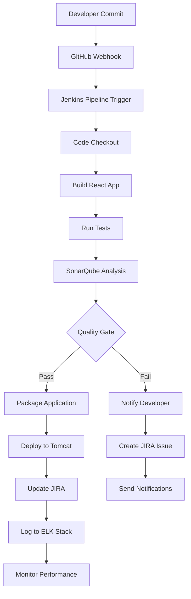

# DevOps Pipeline Documentation 🚀

## Table of Contents
1. [Overview](#overview)
2. [Architecture](#architecture)
3. [Tool Integration](#tool-integration)
4. [Pipeline Workflow](#pipeline-workflow)
5. [Installation Guide](#installation-guide)
6. [Configuration Details](#configuration-details)
7. [Monitoring & Troubleshooting](#monitoring--troubleshooting)
8. [Best Practices](#best-practices)

---

## Overview

This DevOps pipeline provides a complete CI/CD solution for React applications, integrating multiple industry-standard tools to ensure code quality, security, and reliable deployments. The pipeline is containerized using Docker and deployed on AWS EC2 infrastructure.

### Key Capabilities
- **Continuous Integration**: Automated builds and testing
- **Code Quality Analysis**: Static code analysis and security scanning
- **Automated Deployment**: Multiple deployment strategies
- **Comprehensive Monitoring**: Real-time logging and metrics
- **External Tool Integration**: JIRA, GitHub, and more

---

## Architecture

### Infrastructure Components

```
┌─────────────────────────────────────────────────────────────────┐
│                        AWS EC2 Instance                        │
│                      (t3.2xlarge - 8vCPU, 32GB RAM)           │
├─────────────────────────────────────────────────────────────────┤
│  ┌─────────────┐  ┌─────────────┐  ┌─────────────┐            │
│  │   Jenkins   │  │  SonarQube  │  │   Tomcat    │            │
│  │   :8080     │  │   :9000     │  │   :8081     │            │
│  └─────────────┘  └─────────────┘  └─────────────┘            │
│                                                                 │
│  ┌─────────────┐  ┌─────────────┐  ┌─────────────┐            │
│  │Elasticsearch│  │   Kibana    │  │  Logstash   │            │
│  │   :9200     │  │   :5601     │  │   :5000     │            │
│  └─────────────┘  └─────────────┘  └─────────────┘            │
│                                                                 │
│  ┌─────────────────────────────────────────────────────────┐   │
│  │                Docker Engine                            │   │
│  └─────────────────────────────────────────────────────────┘   │
└─────────────────────────────────────────────────────────────────┘
```

### Network Configuration

| Service | Internal Port | External Port | Protocol | Description |
|---------|--------------|---------------|----------|-------------|
| Jenkins | 8080 | 8080 | HTTP | CI/CD Server |
| SonarQube | 9000 | 9000 | HTTP | Code Quality |
| Tomcat | 8081 | 8081 | HTTP | App Server |
| Elasticsearch | 9200 | 10100 | HTTP | Search Engine |
| Kibana | 5601 | 10101 | HTTP | Data Visualization |
| Logstash | 5000/15000 | 5000/15000 | TCP | Log Processing |
| PostgreSQL | 5432 | - | TCP | SonarQube DB |

---

## Tool Integration

### 1. Jenkins - CI/CD Orchestration Hub

**Role**: Central automation server that orchestrates the entire pipeline

**Key Features**:
- Pipeline as Code (Jenkinsfile)
- Multi-branch pipeline support
- Plugin ecosystem integration
- Build artifact management

**Integration Points**:
```yaml
- Source Code: GitHub webhook triggers
- Code Quality: SonarQube analysis integration
- Deployment: Tomcat server deployment
- Monitoring: ELK stack log forwarding
- External Tools: JIRA issue tracking
```

**Pipeline Stages**:
1. **Checkout**: Git repository cloning
2. **Build**: Node.js/React application compilation
3. **Test**: Unit and integration testing
4. **Quality Gate**: SonarQube analysis
5. **Package**: WAR/JAR file creation
6. **Deploy**: Tomcat deployment
7. **Monitor**: Log aggregation

### 2. SonarQube - Code Quality & Security

**Role**: Static code analysis and security vulnerability detection

**Key Features**:
- Code quality metrics (bugs, vulnerabilities, code smells)
- Security hotspot detection
- Technical debt measurement
- Quality gate enforcement

**Integration Workflow**:
```
Jenkins Pipeline → SonarQube Scanner → Analysis Results → Quality Gate Decision
                                    ↓
                               PostgreSQL Database
```

**Quality Metrics Monitored**:
- **Reliability**: Bug detection and classification
- **Security**: Vulnerability and security hotspot analysis
- **Maintainability**: Code smell detection and technical debt
- **Coverage**: Test coverage analysis
- **Duplication**: Code duplication percentage

### 3. ELK Stack - Monitoring & Logging

**Role**: Comprehensive logging, monitoring, and data visualization platform

#### Elasticsearch
- **Function**: Distributed search and analytics engine
- **Data Storage**: Application logs, metrics, and events
- **Search Capabilities**: Real-time log search and aggregation

#### Logstash
- **Function**: Data processing pipeline
- **Log Sources**: Jenkins, SonarQube, Tomcat, application logs
- **Processing**: Log parsing, filtering, and enrichment

#### Kibana
- **Function**: Data visualization and dashboard creation
- **Dashboards**: Pipeline metrics, error tracking, performance monitoring
- **Alerting**: Real-time alert configuration

**Log Flow Architecture**:
```
Application → Logstash → Elasticsearch → Kibana
    ↓           ↓            ↓           ↓
Jenkins → Log Parsing → Indexing → Visualization
SonarQube → Filtering → Storage → Dashboards
Tomcat → Enrichment → Search → Alerts
```

### 4. Tomcat - Application Deployment

**Role**: Production-ready application server for React applications

**Key Features**:
- WAR file deployment
- Multiple deployment strategies
- Application lifecycle management
- Performance monitoring

**Deployment Strategies**:
1. **Rolling Deployment**: Gradual instance replacement
2. **Blue-Green Deployment**: Environment switching
3. **Immediate Deployment**: Direct replacement

### 5. JIRA Integration (External)

**Role**: Project management and issue tracking integration

**Integration Features**:
- **Automated Issue Creation**: Failed builds trigger JIRA tickets
- **Status Updates**: Pipeline status updates in JIRA
- **Release Management**: Version tracking and release notes
- **Reporting**: Build and deployment reports

**Workflow Integration**:
```
GitHub Commit → Jenkins Build → Quality Gate → Deploy → JIRA Update
     ↓              ↓              ↓           ↓         ↓
Issue Reference → Build Link → Quality Report → Deploy Status → Resolution
```

---

## Pipeline Workflow

### Complete CI/CD Flow



### Detailed Stage Breakdown

#### Stage 1: Source Code Management
```groovy
stage('Checkout') {
    steps {
        git branch: 'main', 
            url: 'https://github.com/your-org/react-app.git'
    }
}
```

#### Stage 2: Build Process
```groovy
stage('Build') {
    steps {
        sh 'npm install'
        sh 'npm run build'
    }
}
```

#### Stage 3: Testing
```groovy
stage('Test') {
    steps {
        sh 'npm test -- --coverage --watchAll=false'
    }
    post {
        always {
            publishTestResults testResultsPattern: 'test-results.xml'
        }
    }
}
```

#### Stage 4: Code Quality Analysis
```groovy
stage('SonarQube Analysis') {
    steps {
        withSonarQubeEnv('SonarQube') {
            sh 'npx sonar-scanner'
        }
    }
}

stage('Quality Gate') {
    steps {
        timeout(time: 1, unit: 'HOURS') {
            waitForQualityGate abortPipeline: true
        }
    }
}
```

#### Stage 5: Deployment
```groovy
stage('Deploy') {
    steps {
        script {
            def warFile = "target/${env.BUILD_NUMBER}-react-app.war"
            sh "cp build/* ${warFile}"
            deployToTomcat(warFile)
        }
    }
}
```

---

## Installation Guide

### Prerequisites
- AWS Account with EC2 permissions
- Terraform >= 1.0
- AWS CLI configured
- SSH key pair (Pair06.pem)

### Quick Installation

1. **Infrastructure Deployment**:
```bash
# Clone repository
git clone <repository>
cd ELK

# Deploy infrastructure
terraform init
terraform plan
terraform apply
```

2. **Service Installation**:
```bash
# Connect to instance
ssh -i "Pair06.pem" ec2-user@<instance-ip>

# Run installation scripts
./install-elk.sh
./install-jenkins.sh
./install-sonarqube.sh
./install-tomcat.sh
```

3. **Integration Setup**:
```bash
# Configure integrations
./install-jira-integration.sh
./create-jenkins-jobs.sh
./setup-elk-logging.sh
```

4. **Verification**:
```bash
# Run integration tests
./integration-tests.sh
```

### Manual Configuration Steps

#### Jenkins Setup
1. Access Jenkins at `http://<instance-ip>:8080`
2. Retrieve admin password: `docker exec jenkins cat /var/jenkins_home/secrets/initialAdminPassword`
3. Install suggested plugins
4. Create admin user
5. Configure SonarQube plugin

#### SonarQube Configuration
1. Access SonarQube at `http://<instance-ip>:9000`
2. Login with admin/admin
3. Change default password
4. Create project for React app
5. Generate authentication token

#### JIRA Integration
1. Obtain JIRA API token from your instance
2. Run: `./install-jira-integration.sh`
3. Configure webhook endpoints
4. Test connectivity

---

## Configuration Details

### Environment Variables

```bash
# Jenkins Configuration
JENKINS_HOME=/var/jenkins_home
JENKINS_URL=http://localhost:8080

# SonarQube Configuration
SONAR_HOST_URL=http://localhost:9000
SONAR_LOGIN=<token>

# ELK Configuration
ELASTICSEARCH_URL=http://localhost:9200
KIBANA_URL=http://localhost:5601

# JIRA Configuration
JIRA_URL=https://your-instance.atlassian.net
JIRA_USERNAME=<username>
JIRA_API_TOKEN=<token>
```

### Docker Networks

```yaml
Networks:
  - elk-network: Elasticsearch, Logstash, Kibana
  - sonarqube-network: SonarQube, PostgreSQL
  - jenkins-network: Jenkins container
  - tomcat-network: Tomcat application server
```

### Volume Mappings

```yaml
Persistent Volumes:
  - jenkins-data: /var/jenkins_home
  - sonarqube-data: /opt/sonarqube/data
  - elasticsearch-data: /usr/share/elasticsearch/data
  - postgres-data: /var/lib/postgresql/data
  - tomcat-webapps: /usr/local/tomcat/webapps
```

---

## Monitoring & Troubleshooting

### Health Check Endpoints

| Service | Health Check URL | Expected Response |
|---------|------------------|-------------------|
| Jenkins | `http://localhost:8080/login` | HTTP 200/403 |
| SonarQube | `http://localhost:9000/api/system/status` | `{"status":"UP"}` |
| Elasticsearch | `http://localhost:10100/_cluster/health` | `{"status":"green"}` |
| Kibana | `http://localhost:10101/api/status` | `{"status":"green"}` |
| Tomcat | `http://localhost:8081` | HTTP 200/404 |

### Service Management Commands

```bash
# View all containers
docker ps -a

# Check service logs
docker logs <container-name>

# Restart specific service
docker restart <container-name>

# Restart all services
./restart-all-services.sh

# Run integration tests
./integration-tests.sh
```

### Common Issues & Solutions

#### 1. Jenkins Build Failures
**Problem**: Node.js not found in Jenkins container
**Solution**: 
```bash
docker exec jenkins curl -fsSL https://deb.nodesource.com/setup_18.x | sudo -E bash -
docker exec jenkins sudo apt-get install -y nodejs
```

#### 2. SonarQube Connectivity Issues
**Problem**: SonarQube cannot connect to PostgreSQL
**Solution**:
```bash
docker restart sonarqube-db
docker restart sonarqube
```

#### 3. Elasticsearch Memory Issues
**Problem**: Elasticsearch fails to start due to memory constraints
**Solution**:
```bash
# Increase VM max map count
echo 'vm.max_map_count=262144' | sudo tee -a /etc/sysctl.conf
sudo sysctl -p
```

### Log Locations

```bash
# Application logs
/var/log/jenkins/jenkins.log
/opt/sonarqube/logs/sonarqube.log
/usr/local/tomcat/logs/catalina.out

# Docker container logs
docker logs jenkins
docker logs sonarqube
docker logs elasticsearch
```

---

## Best Practices

### Security
1. **Change Default Passwords**: Update all default credentials
2. **Enable HTTPS**: Configure SSL certificates for production
3. **Network Segmentation**: Use Docker networks for isolation
4. **Access Control**: Implement role-based access control
5. **Secret Management**: Use Jenkins credentials store

### Performance
1. **Resource Allocation**: Monitor CPU and memory usage
2. **Build Optimization**: Use incremental builds and caching
3. **Database Maintenance**: Regular PostgreSQL maintenance
4. **Log Rotation**: Implement log rotation policies
5. **Monitoring**: Set up alerts for resource thresholds

### Maintenance
1. **Regular Updates**: Keep all tools updated
2. **Backup Strategy**: Regular data backups
3. **Capacity Planning**: Monitor growth trends
4. **Documentation**: Keep configurations documented
5. **Disaster Recovery**: Test backup and recovery procedures

### Development Workflow
1. **Branch Strategy**: Use GitFlow or similar branching model
2. **Code Reviews**: Mandatory peer reviews
3. **Quality Gates**: Enforce quality standards
4. **Testing Strategy**: Comprehensive test coverage
5. **Deployment Strategy**: Use appropriate deployment patterns

---

## Support & Maintenance

### Regular Maintenance Tasks

```bash
# Weekly tasks
./integration-tests.sh          # Verify all services
docker system prune            # Clean unused containers
./backup-configurations.sh     # Backup configs

# Monthly tasks
./update-services.sh           # Update service versions
./security-scan.sh            # Security vulnerability scan
./performance-review.sh       # Performance analysis
```

### Monitoring Dashboards

Access monitoring dashboards:
- **Jenkins**: `http://<instance-ip>:8080/manage`
- **SonarQube**: `http://<instance-ip>:9000/projects`
- **Kibana**: `http://<instance-ip>:10101/app/monitoring`
- **System Metrics**: `http://<instance-ip>:10101/app/metrics`

### Support Contacts

For technical support and issues:
- **Infrastructure**: AWS Support Console
- **Application Issues**: Check integration test results
- **Performance Issues**: Kibana monitoring dashboards
- **Security Issues**: SonarQube security reports

---

*This documentation is maintained by the DevOps team. Last updated: October 2025*